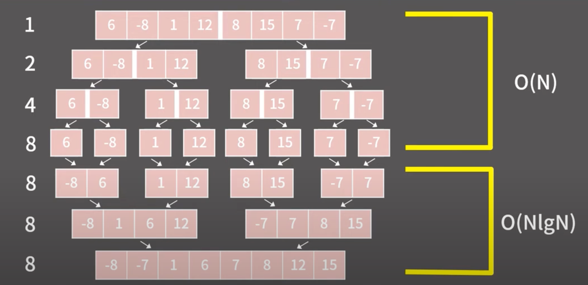

# 정렬

```text
인터뷰 준비를 위한 정렬 알고리즘 정리

1. Selection Sort (선택 정렬)
O(N^2) 시간 복잡도
가장 작은(또는 큰) 요소를 찾아 맨 앞(또는 뒤)에 위치시키는 방식
구현이 간단하지만, 효율성은 떨어짐

2. Bubble Sort (버블 정렬)
O(N^2) 시간 복잡도
인접한 두 요소를 비교하여 정렬하는 방식
여러 번 반복하여 정렬이 완료될 때까지 진행
결국 가장 큰(또는 작은) 요소가 맨 뒤(또는 앞)로 이동
구현이 간단하지만, 효율성은 떨어짐

3. Merge Sort (병합 정렬)
O(NlogN) 시간 복잡도
분할 정복 알고리즘의 일종
배열의 중간을 기준으로 두 개의 하위 배열로 분할
각 하위 배열을 재귀적으로 정렬한 후 병합하여 최종 정렬

4. Quick Sort (퀵 정렬)
```

Merge Sort 핵심 동작 이미지
