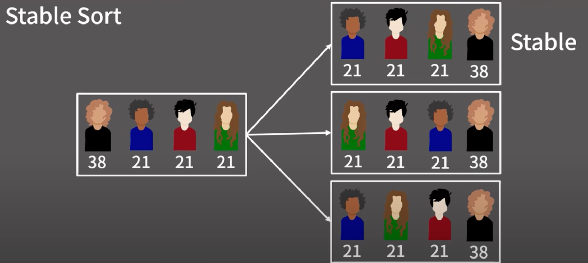

# 정렬

```text
인터뷰 준비를 위한 정렬 알고리즘 정리

1. Selection Sort (선택 정렬)
O(N^2) 시간 복잡도
가장 작은(또는 큰) 요소를 찾아 맨 앞(또는 뒤)에 위치시키는 방식
구현이 간단하지만, 효율성은 떨어짐

2. Bubble Sort (버블 정렬)
O(N^2) 시간 복잡도
인접한 두 요소를 비교하여 정렬하는 방식
여러 번 반복하여 정렬이 완료될 때까지 진행
결국 가장 큰(또는 작은) 요소가 맨 뒤(또는 앞)로 이동
구현이 간단하지만, 효율성은 떨어짐

3. Merge Sort (병합 정렬)
O(NlogN) 시간 복잡도
분할 정복 알고리즘의 일종
배열의 중간을 기준으로 두 개의 하위 배열로 분할
각 하위 배열을 재귀적으로 정렬한 후 병합하여 최종 정렬

4. Quick Sort (퀵 정렬)
O(NlogN) 시간 복잡도 (평균)
마찬가지로 재귀적으로 정렬을 수행
병합 정렬과 다르게 추가적인 배열이 필요하지 않아서 In-Place 정렬 알고리즘이라고 부른다
```
### Merge Sort (병합 정렬) 설명

Merge Sort 핵심 동작 이미지


```text
Merge Sort = Stable Sort

Stable Sort?
안정 정렬이란 동일한 값(가치)의 원소들이 정렬 후에도 원래의 상대적인(기존) 
순서를 유지하는 정렬 알고리즘을 의미합니다. 

즉, Merge Sort 같은 경우 왼쪽 리스트와 오른쪽 리스트에서 동일한 값이 있을 때,
왼쪽 리스트에 있는 값이 먼저 오기 때문에 안정 정렬로 분류됩니다.
```

Merge Sort = Stable Sort


### Quick Sort (퀵 정렬) 설명

```text
거의 모든 정렬 알고리즘 중에서 가장 빠른 정렬 알고리즘
그래서 라이브러리의 기본 정렬 알고리즘으로 자주 사용(포함)된다

하지만 코딩 테스트에서 직접 정렬 알고리즘을 구현해야 하는 경우
사용을 권장하지 않는다
일단, 구현이 복잡하고, 최악의 경우 O(N^2) 시간 복잡도를 가질 수 있기 때문이다.

라이브러리에서는 최악의 케이스를 피하기 위해서
퀵 정렬 + 병합 정렬 + 힙 정렬을 조합한 하이브리드 정렬 알고리즘을 사용한다
```


O(N^2) 시간 복잡도가 나오는 최악의 경우


### Merge Sort vs Quick Sort

| 정렬 알고리즘   | 시간 복잡도         | 추가적인 공간 | Stable 여부 |
|----------------|--------------------|--------------|-----------|
| Merge Sort     | O(NlogN)           | O(N)         | O         |
| Quick Sort     | O(NlogN) (평균)    | O(1)         | X         |

```text
Quick Sort 같은 경우 대부분의 케이스에서 Merge Sort 보다 빠르다 
하지만 최악의 경우 O(N^2) 시간 복잡도를 가질 수 있다
실제 라이브러리에서는 이런 최악의 케이스를 피하기 위해서 
피봇을 무작위로 선택하거나, 작은 배열에 대해서는 Insertion Sort 같은 다른 정렬 알고리즘을 사용하는 등의
최적화 기법을 추가적으로 사용한다
```
