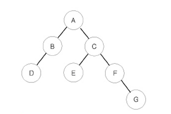

# 트리 순회

```text
이진 트리 순회는 트리의 모든 노드를 방문하는 방법입니다.

이진 트리 순회 종류
1. 전위 순회 (Pre-order Traversal): 노드를 먼저 방문한 후 왼쪽 서브트리, 오른쪽 서브트리를 순회합니다.
2. 중위 순회 (In-order Traversal): 왼쪽 서브트리를 먼저 순회한 후 노드를 방문하고, 마지막으로 오른쪽 서브트리를 순회합니다.
3. 후위 순회 (Post-order Traversal): 왼쪽 서브트리, 오른쪽 서브트리를 먼저 순회한 후 노드를 방문합니다.
```


- 전위 순회 결과: A B D C E F G
- 중위 순회 결과: D B A E C F G
- 후위 순회 결과: D B E G F C A


